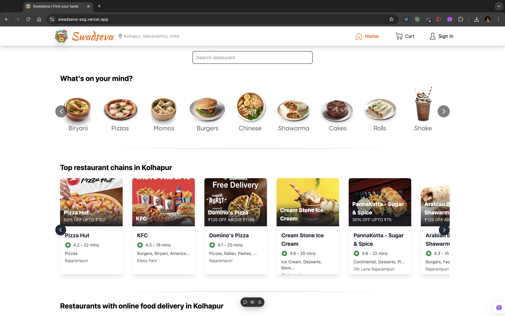

# 😀𝗣𝗿𝗼𝘂𝗱𝗹𝘆 𝗽𝗿𝗲𝘀𝗲𝗻𝘁𝗶𝗻𝗴 𝗦𝘄𝗮𝗱𝘀𝗲𝘃𝗮🍕  

A highly scalable and performant food ordering app utilizing real-time Swiggy API, featuring fast loading, optimized menu browsing, and a beautiful UI enhanced for an engaging user experience.

---

### 🔗 Live Project: [Swadseva Live Project](https://swadseva-ssg.vercel.app/)  

### 🔗 Source Code: [Swadseva GitHub Repo](https://github.com/surajgharpankar28/SwadSeva.git)  

--- 

--- 

## 💠𝗞𝗲𝘆 𝗙𝗲𝗮𝘁𝘂𝗿𝗲𝘀:  

- **📦𝗟𝗶𝘃𝗲 𝗦𝘄𝗶𝗴𝗴𝘆 𝗗𝗮𝘁𝗮**: Access real-time menu and order information.    
- **🛒𝗗𝘆𝗻𝗮𝗺𝗶𝗰 𝗖𝗮𝗿𝘁 𝗠𝗮𝗻𝗮𝗴𝗲𝗺𝗲𝗻𝘁**: View billing summaries and easily manage or edit cart items.    
- **✨𝗦𝗵𝗶𝗺𝗺𝗲𝗿 𝗘𝗳𝗳𝗲𝗰𝘁**: Enhance loading experiences with stylish shimmer effects.  
- **📱𝗦𝗺𝗼𝗼𝘁𝗵 𝗡𝗮𝘃𝗶𝗴𝗮𝘁𝗶𝗼𝗻**: Effortless transitions between pages for an intuitive user journey.  
- **⚡𝗣𝗲𝗿𝗳𝗼𝗿𝗺𝗮𝗻𝗰𝗲 𝗢𝗽𝘁𝗶𝗺𝗶𝘇𝗮𝘁𝗶𝗼𝗻**: Features like memoization and lazy loading for faster app performance.  
- **📏𝗥𝗲𝘀𝗽𝗼𝗻𝘀𝗶𝘃𝗲 𝗗𝗲𝘀𝗶𝗴𝗻**: A fully responsive layout ensuring accessibility across all devices.  

---

## 💠𝗧𝗼𝗼𝗹𝘀 𝗨𝘀𝗲𝗱:  

- **⚛️𝗥𝗲𝗮𝗰𝘁**: The core of the app, used for building dynamic, component-based user interfaces.  
- **🔄𝗥𝗲𝗱𝘂𝘅**: For state management, making it easier to manage data across the application and improve performance.  
- **🛣️𝗥𝗲𝗮𝗰𝘁 𝗥𝗼𝘂𝘁𝗲𝗿**: Ensures seamless navigation between different pages or views, enhancing the single-page app experience.  
- **🎨𝗧𝗮𝗶𝗹𝘄𝗶𝗻𝗱 𝗖𝗦𝗦**: Allows for quick and responsive design with a utility-first approach, helping build a consistent UI with minimal custom styling.  
- **🍽️𝗦𝘄𝗶𝗴𝗴𝘆 𝗔𝗣𝗜**: Provides real-time data for restaurant menus, ratings, and delivery details, essential for building a feature-rich food ordering application.  

---

## 💡 Special Thanks  

I would like to extend my gratitude to my mentor, <a href="https://www.linkedin.com/in/akshaymarch7/" target="_blank"><b>Akshay Saini 🚀</b></a>, and the invaluable learnings from <a href="https://namastedev.com" target="_blank"><b>NamasteDev.com</b></a>.
 

---

## 🙌 Support  

Thank you! Your support and contributions would mean the world! If my work resonates with you or if you're looking for a frontend developer with a passion for creating engaging websites, I'd be glad if you'd consider referring me. All my other resources are waiting for you in the app’s footer.  

---

Let me know if you'd like further tweaks! 